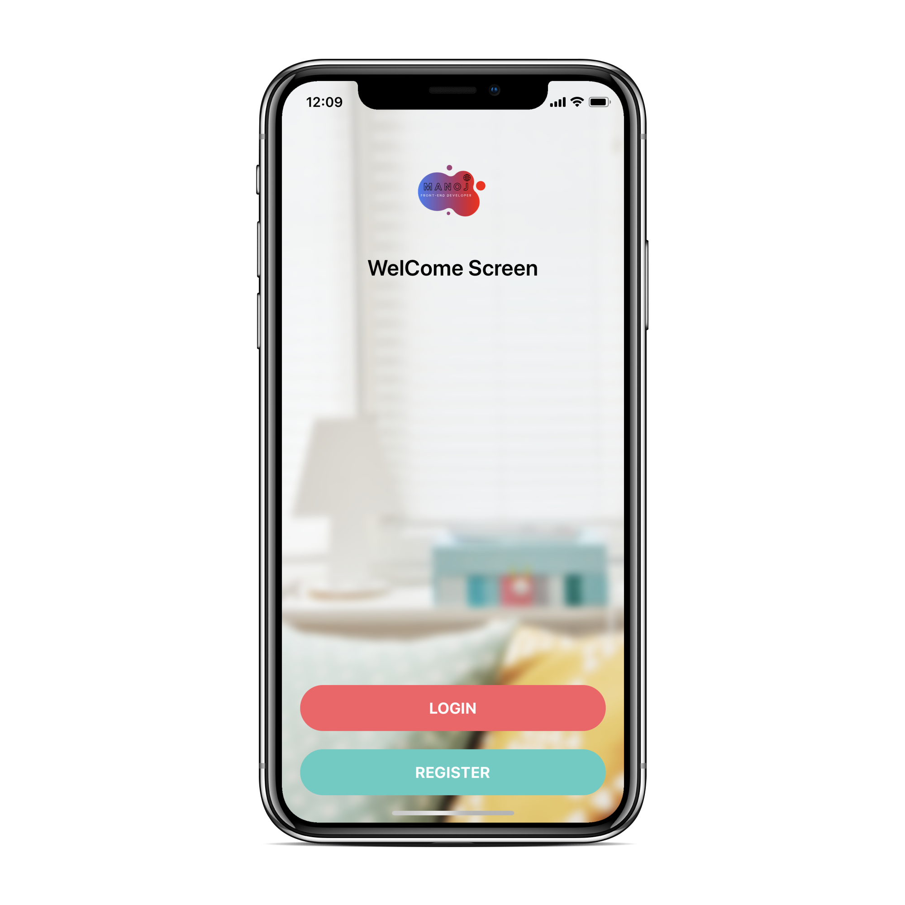
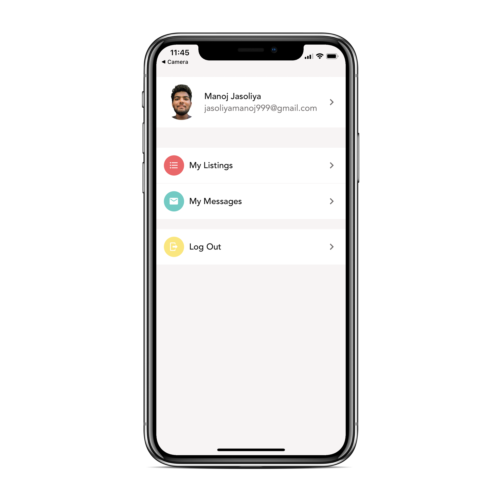

## React Native Screens

A simple cross platform (iOS and Android) React Native timer app.

<!--   -->

|         Welcome          |         Account          |
| :----------------------: | :----------------------: |
|       |       |
|          SignIn          |         Register         |
| :----------------------: | :----------------------: |
|       |       |

### Installation

- `git clone https://github.com/Manojj999/RN-Timer.git`
- `yarn install`/`npm install`

### Running

---

## Emulator:

- `yarn run ios`/`npm run ios` or `yarn run android`/`npm run android`

## Actual Device

- Install Expo Client on Android Or Ios then
- `yarn start`/`npm start`
- Scan Qr code
